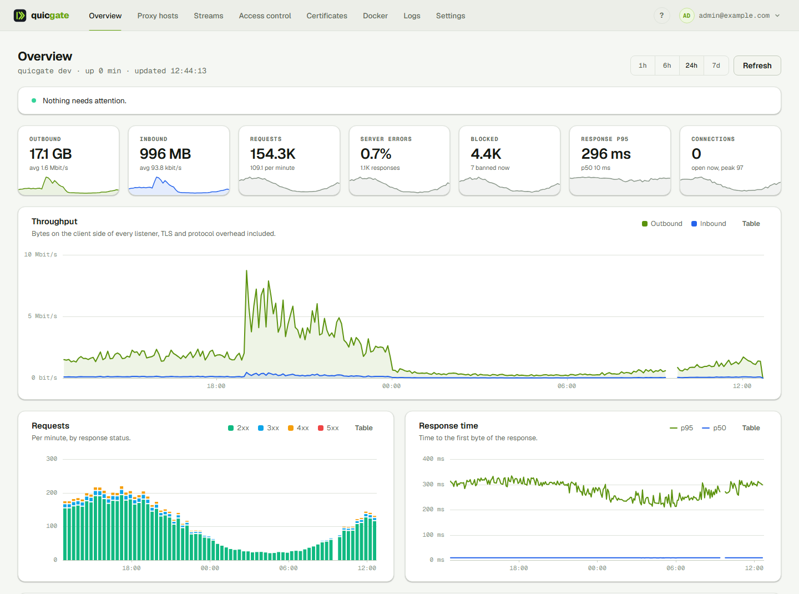
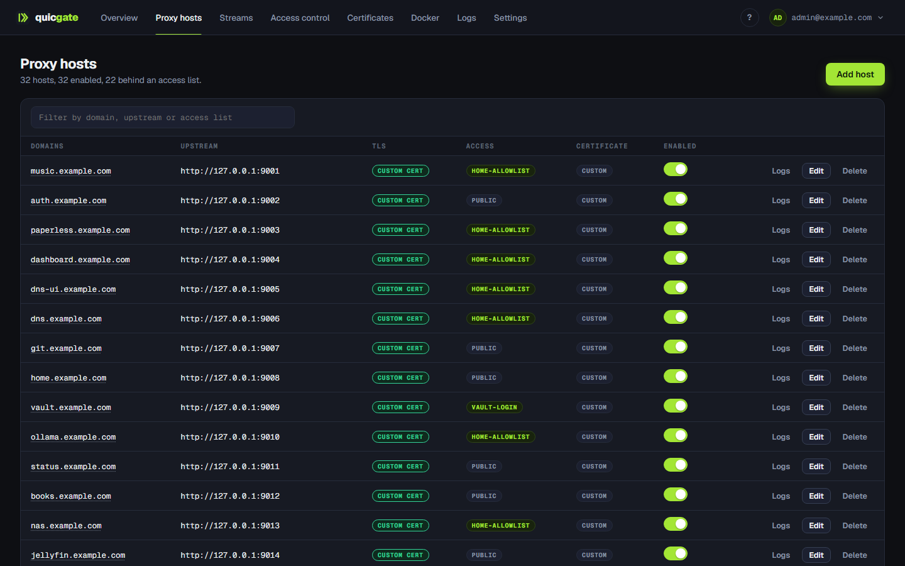
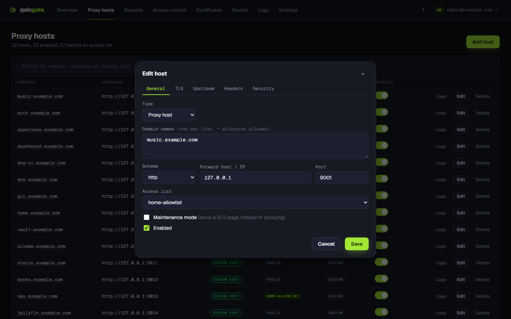
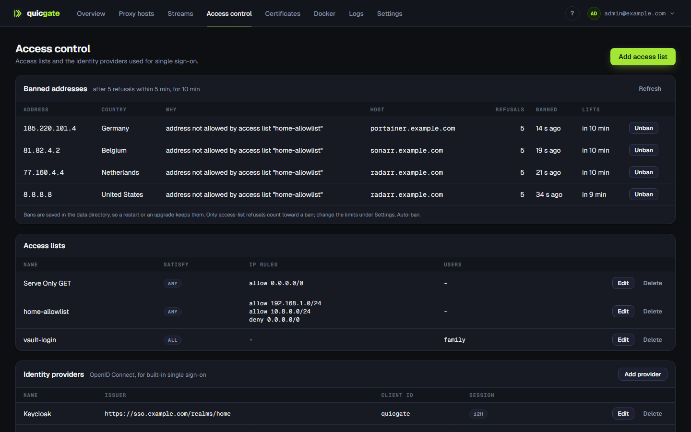
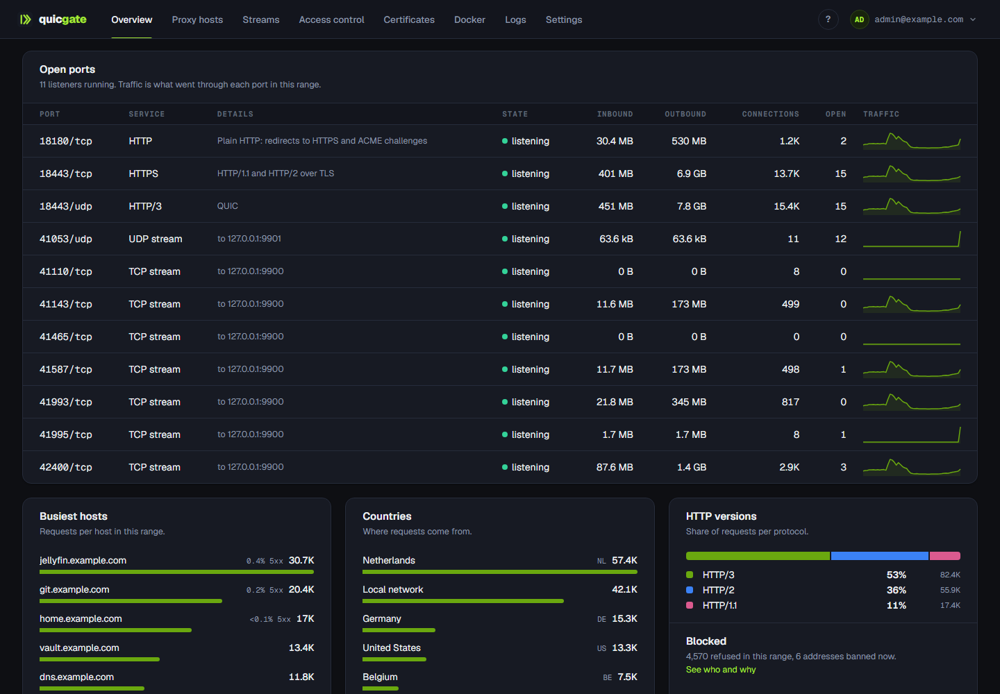

<p align="center">
  <picture>
    <source media="(prefers-color-scheme: dark)" srcset="brand/logo-full-dark.svg">
    
  </picture>
</p>

<h3 align="center">The reverse proxy manager you would actually enjoy running.</h3>

<p align="center">
  Point-and-click hosts, automatic HTTPS, HTTP/3, single sign-on and live traffic charts.<br>
  <b>One Go binary. One 25 MB container. No nginx, no Traefik, no sidecars.</b>
</p>

<p align="center">
  <a href="https://github.com/Quicgate/quicgate/releases"></a>
  <a href="https://github.com/Quicgate/quicgate/actions/workflows/docker.yml"></a>
  <a href="LICENSE"></a>
  
  
  <a href="https://github.com/Quicgate/quicgate/stargazers"></a>
</p>

<p align="center">
  <a href="#quick-start">Quick start</a> &middot;
  <a href="#a-look-around">Screenshots</a> &middot;
  <a href="#what-you-get">Features</a> &middot;
  <a href="#how-it-compares">Comparison</a> &middot;
  <a href="#documentation">Docs</a>
</p>

<p align="center">
  <picture>
    <source media="(prefers-color-scheme: dark)" srcset="brand/screenshots/overview-dark.png">
    
  </picture>
</p>

## Why quicgate

Most homelabs end up with the same pile: a proxy, something to manage it, something for
certificates, something for login, fail2ban, an exporter and a log viewer. quicgate is that pile as
one small program with a UI you can hand to someone else.

- **Add a host in seconds.** Domain, upstream, save. The certificate issues itself and the route
  is live instantly: no reloads, no restarts, no config files.
- **Single sign-on without a second service.** quicgate runs the OpenID Connect login itself
  against Keycloak, Entra ID, Authentik or any compliant provider, per host or even per URL.
- **HTTP/3 on every host by default.** A native Go data plane on `net/http` and quic-go, not a
  wrapper around someone else's proxy.
- **See what is happening.** A week of traffic charts, open ports with their throughput, busiest
  hosts, visitor countries, and who got refused and why.
- **Nothing to break with a typo.** Every option is a typed, validated field. There is no free-text
  config box, so there is no way to take the proxy down with a missing semicolon.
- **Small enough to trust.** One static binary in a `FROM scratch` image, signed build provenance,
  a vulnerability gate in CI, and guides that work offline inside the binary.

> I loved Nginx Proxy Manager's workflow but not its internals, and Pangolin's engine but not its
> moving parts. quicgate is the NPM experience rebuilt on a modern engine. It has been the only
> ingress of my own homelab (about 45 hosts, mail and media streams) since July 2026.

## Quick start

```yaml
# docker-compose.yml
services:
  quicgate:
    image: ghcr.io/quicgate/quicgate:latest
    restart: unless-stopped
    network_mode: host      # engine owns 80/443 (tcp+udp), admin UI on 81
    environment:
      - QG_ACME_EMAIL=you@example.com
    volumes:
      - ./data:/data
```

```bash
docker compose up -d
```

Open `http://<host>:81`, sign in with `admin@example.com` / `changeme` (you are made to change it
right away), add your first proxy host, and watch the certificate arrive.

> [!WARNING]
> Never expose port 81 to the internet. Put the admin UI behind quicgate itself with an access
> list, a VPN or a firewall rule, like any other private service.

Prefer bridge networking, or want router port forwards managed for you over UPnP? See the comments
in [`docker-compose.yml`](docker-compose.yml) and the [getting started guide](web/docs/getting-started.md).

## A look around

| | |
|---|---|
| [](brand/screenshots/hosts.png) | [](brand/screenshots/host-edit.png) |
| **Proxy hosts.** Everything on one screen: upstream, TLS, which access list guards it, and a per-host log. | **Typed options, not config snippets.** TLS, upstream pools, header rules and security each get their own tab. |
| [](brand/screenshots/access.png) | [](brand/screenshots/ports.png) |
| **Access control.** Access lists, identity providers, and the addresses auto-ban is refusing, with the reason. | **Open ports.** Every listener and stream with its traffic, plus busiest hosts, countries and HTTP versions. |

## It replaces the whole stack

| Instead of | quicgate gives you |
|---|---|
| Nginx Proxy Manager, nginx | proxy hosts, certificates, redirects, static sites, a UI |
| Traefik, Caddy | routing, ACME, Docker label discovery, HTTP/3 |
| Authelia, oauth2-proxy, Pomerium | OIDC login, group policy, `Remote-User` passed upstream |
| fail2ban, an exporter, a log viewer | auto-ban, Prometheus `/metrics`, JSON access logs with a viewer |

## Single sign-on, without a sidecar

Most proxies hand SSO to a second service. quicgate runs the OpenID Connect login itself: PKCE and a
nonce, ID-token signature verification, and a signed session cookie bound to the host **and** to the
provider that issued it.

Define an identity provider once, then choose per host who gets in: by email, by email domain or by
group. Optionally pass the identity upstream as `Remote-User` / `Remote-Email` / `Remote-Groups`, so
apps with proxy-auth support log the user straight in. Inbound copies of those headers are always
stripped, so a client can never forge them.

Authentication can differ **per URL** on the same host, which is what real apps need:

| Path | Gate |
|---|---|
| `/ValidationService.asmx` | public: a licensing callback that cannot log in |
| `/webhooks/` | public, `POST` only |
| `/admin/` | OIDC, group `platform-admins` |
| everything else | OIDC, any employee |

Different paths can even use **different identity providers**: staff on the company IdP, a partner
endpoint on theirs. Already running Authelia or Authentik? Point a host at its verify endpoint with
forward-auth instead. Details in the [Access control & SSO guide](web/docs/sso.md).

## What you get

<details open>
<summary><b>Proxying</b></summary>

Proxy, redirect (301/302/307/308), 404 and static hosts &middot; wildcard domains &middot;
load-balanced pools with health checks and sticky sessions &middot; custom locations &middot; path
rewrites (strip or add a prefix, RE2) &middot; maintenance mode &middot; response caching &middot; gzip
</details>

<details open>
<summary><b>TLS and HTTP/3</b></summary>

Automatic Let's Encrypt (HTTP-01), DNS-01 wildcards, custom ACME CAs (ZeroSSL, step-ca) &middot;
upload your own certificates or generate self-signed ones &middot; mTLS client certificates &middot;
HSTS &middot; HTTP/1.1, HTTP/2 and **HTTP/3 (QUIC)** on every host, with a per-host toggle
</details>

<details open>
<summary><b>Access control</b></summary>

Ordered access lists by IP/CIDR, dynamic-DNS hostname or GeoIP country &middot; basic auth &middot;
rules scoped to HTTP methods &middot; built-in OIDC SSO and forward-auth &middot; per-path rules
&middot; rate limiting &middot; exploit and bad-bot filters &middot; fail2ban-style auto-ban with a
never-ban list &middot; real client IP behind Cloudflare or another load balancer
</details>

<details>
<summary><b>Streams (TCP/UDP)</b></summary>

L4 forwards with source allowlists &middot; PROXY protocol v1/v2 &middot; TLS termination &middot;
SNI passthrough routing &middot; port ranges &middot; router port forwards managed over **UPnP**,
self-healing after a router reboot
</details>

<details>
<summary><b>Docker</b></summary>

Opt a container in with `quicgate.enable=true` and its host (and streams) are derived from labels:
Traefik's provider idea without the router/service/middleware soup. Multi-host, and every derived
route shows why it is or is not routing.
</details>

<details>
<summary><b>Dual-stack</b></summary>

IPv6 clients, IPv6-literal and AAAA upstreams, IPv6 CIDRs in access lists and trusted-proxy lists,
GeoIP and rate limits on v6 alike.
</details>

<details>
<summary><b>Operations</b></summary>

Overview with a week of traffic charts &middot; JSON access logs with a built-in viewer &middot;
Prometheus `/metrics` &middot; one-click backup and restore &middot; declarative JSON import &middot;
certificate-renewal alerts (ntfy, Gotify) &middot; TOTP 2FA &middot; API tokens &middot; OIDC or
LDAP admin login &middot; offline guides in the UI &middot; light and dark, and a choice of themes
</details>

What is built, tested and qualified against real infrastructure, and what is deliberately deferred,
is tracked row by row in [FEATURES.md](FEATURES.md).

## How it compares

| | **quicgate** | **Nginx Proxy Manager** | **Pangolin** |
|---|---|---|---|
| Data plane | native Go (net/http, quic-go) | nginx | Traefik |
| Deployment | **1 container, ~25 MB, scratch** | 1 container (+ optional db) | 3+ containers |
| HTTP/3 (QUIC) | **default, per-host toggle** | no | via Traefik config |
| Config model | **typed, validated options** | UI + free-text nginx snippets | UI + Traefik config |
| Applying a change | instant atomic swap | nginx reload | Traefik provider push |
| SSO on your services | **built-in OIDC + forward-auth** | no | **built-in IdP/SSO** |
| Per-URL auth policy | **yes** | no | per resource |
| Access lists | IP/CIDR + **GeoIP + dynamic DNS** | IP/CIDR | yes |
| TCP/UDP streams | yes, + PROXY protocol, SNI, TLS termination | basic | via tunnels |
| WireGuard tunnels to remote sites | no | no | **yes, Pangolin's killer feature** |
| Config from container labels | **yes, flat labels + streams** | no | via Traefik labels |
| Metrics and API | Prometheus + full REST + OpenAPI | none / undocumented REST | via Traefik / REST |
| Maturity | **young, read the caveats** | battle-tested, huge community | growing fast |

**Choose NPM** for the most battle-tested option and years of community answers.
**Choose Pangolin** if you need WireGuard tunnels to reach services on remote machines.
**Choose quicgate** if you want one small container to replace the whole stack (proxy,
certificates, access control and SSO) on a modern engine.

### Honest caveats

- Young project with one production deployment (mine), so expect rough edges. Issues are welcome.
- Not everything has met the real world yet. The built-in OIDC SSO, for one, is tested against a
  synthetic identity provider: try it against yours before you rely on it.
  [FEATURES.md](FEATURES.md) says per feature what is proven live and what is only tested.
- No WireGuard tunnelling: quicgate proxies to upstreams it can reach over the network.
- A single admin account (with 2FA, OIDC or LDAP login), no multi-tenant roles.

## Performance

On a Ryzen 7 9800X3D: **~45,000 proxied requests/sec** to a local backend, **~180,000/sec** for cache
hits, ~9 ns routing lookups, and ~8,900 TLS-proxied req/s on a single core. Access lists add no
measurable overhead. Those are microbenchmarks on one machine, not a sustained-load qualification,
and authentication, TLS and your backends change the picture, so measure your own workload.
Reproduce with `go test -bench=. ./internal/engine`; methodology in [BENCHMARKS.md](BENCHMARKS.md).

## Supply chain

Release images are multi-arch (amd64, arm64), built in CI from a digest-pinned base, gated by
`govulncheck`, and carry signed SLSA build provenance you can verify yourself:

```bash
gh attestation verify oci://ghcr.io/quicgate/quicgate:latest --owner Quicgate
```

Pin `ghcr.io/quicgate/quicgate:1` to follow the 1.x line: patches arrive, a major version never
does on its own.

## Documentation

The guides live in [`web/docs/`](web/docs/) and are **built into the binary**: open Help (`?` in
the top bar) and pick one. They work offline, air-gapped installs included.

- [Getting started](web/docs/getting-started.md): run it, first host, TLS modes, host types, themes
- [Configuration reference](web/docs/configuration.md): env vars and settings, real client IP, GeoIP, HTTP/3, IPv6
- [Access control & SSO](web/docs/sso.md): access lists, OIDC login, forward auth, per-path rules, security model
- [Docker labels](web/docs/docker.md): hosts and streams from container labels, multi-host
- [Streams & port forwards](web/docs/streams.md): TCP/UDP forwarding, PROXY protocol, SNI routing, UPnP

## API

Everything the UI does is a REST call: interactive Swagger at `/docs.html`, the spec at
`/openapi.yaml`, prose in [API.md](API.md). Create a bearer token under the account menu, API tokens:

```bash
curl -H "Authorization: Bearer $TOKEN" http://<host>:81/api/hosts
```

`POST /api/import` does idempotent, declarative bulk import, which is how my own NPM and Pangolin
migrations were scripted.

## Building from source

```bash
go build .                   # single static binary
docker build -t quicgate .   # multi-stage, FROM scratch
```

Dev mode without TLS: `QG_TLS=off QG_HTTP=:8090 QG_ADMIN=:8091 QG_DATA=./devdata go run .`

## Project

- [SPEC.md](SPEC.md): the NPM feature-parity matrix and architecture decisions
- [ROADMAP.md](ROADMAP.md): features mined from NPM's issue tracker (all five phases implemented)
- [CHANGELOG.md](CHANGELOG.md): what changed, release by release
- [CONTRIBUTING.md](CONTRIBUTING.md): quicgate is deliberately opinionated (one binary, typed options, no free-text config)
- [SECURITY.md](SECURITY.md): found a vulnerability? Report it privately, never as a public issue

If quicgate saves you a container or three, a star helps other self-hosters find it.

## License

[MIT](LICENSE)
